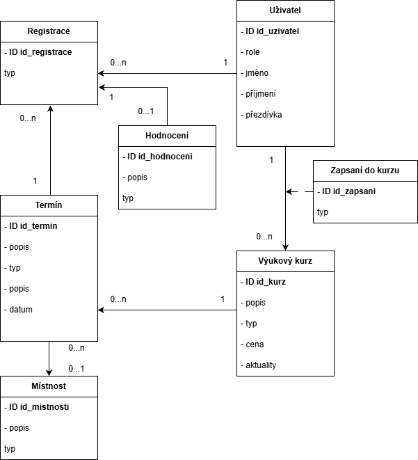

# WIS2

Informační systém pro správu a registraci výukových kurzů. Aplikace pokrývá vše od založení kurzu přes schválení administrátorem, vypsání termínů, přiřazení lektorů, přihlašování studentů a jejich závěrečné hodnocení. Systém funguje podobně jako běžné univerzitní informační systémy.

V aplikaci jsou definovány tyto uživatelské role:
* **Neregistrovaný uživatel:** Vidí pouze dostupné kurzy a jejich veřejný obsah.
* **Registrovaný uživatel:** Může si upravovat profil a prohlížet rozvrh. Zapisuje se na termíny jako student. Může také navrhnout nový kurz a stát se jeho garantem (spravuje parametry, schvaluje studenty, přidává lektory), nebo působit jako lektor a hodnotit studenty.
* **Administrátor:** Má na starosti správu uživatelů, přidávání místností a schvalování kurzů.

---

### Autoři
* **zelvamaty** (vedoucí týmu) – *Návrh a implementace backendu, návrh databáze, testování*
* **xSpoot** – *Návrh a implementace frontendu, testování*
* **Jastrobaron** – *Správa serveru, správa prostředí, automatizace deploymentu, testování, dokumentace*


---

## Uživatelé systému pro testování

| Login | Heslo | Role |
| :--- | :--- | :--- |
| `admin_main` | `****` | Administrátor |
| `user1` | `****` | Registrovaný uživatel – garant kurzu |
| `user2` | `****` | Registrovaný uživatel – student |
| `user3` | `****` | Registrovaný uživatel – student |
| `user4` | `****` | Registrovaný uživatel – student |
| `user5` | `****` | Registrovaný uživatel – student |
| `user6` | `****` | Registrovaný uživatel – lektor |
| `user7` | `****` | Registrovaný uživatel – lektor |

### Video
Video prezentace je dostupná [zde](https://drive.google.com/file/d/11LZXMwFuwJeMAyvqi5klwXXuNt5kigRJ/view?usp=sharing).

---

## Implementace

### Přehled
Pro implementaci jsme zvolili framework **Django (Python)** pro backend a **React (JavaScript)** pro frontend. 

Na produkci jsou oba tyto servery skryté za reverzní proxy **Apache 2**, která běží na stejném serveru. Celý systém je chráněn proxy serverem od služby **Cloudflare** se související konfigurací DNS. Komunikace se světem probíhá prostřednictvím HTTPS; servery aplikace samotné běží na localhostu, kde šifrování komunikace není vyžadováno.

### Backend
| Soubor | Účel |
| :--- | :--- |
| `core/urls.py` | Základ routeru |
| `core/views.py` | Presentery |
| `core/models.py` | Datový model |
| `core/serializers.py` | Serializace modelu do JSON a validace |

### Frontend
| Soubor | Účel |
| :--- | :--- |
| `AdminCourses.js` | Schvalování kurzů (pouze admin) |
| `AdminDashboard.js` | Dashboard (pouze admin) |
| `AdminRooms.js` | Správa místností (pouze admin) |
| `AdminUsers.js` | Správa uživatelů (pouze admin) |
| `CreateCourse.js` | Formulář pro vytvoření kurzu |
| `EditCourse.js` | Formulář pro úpravu kurzu |
| `InstructorCourse.js` | Správa kurzu garantem |
| `Login.js` | Formulář pro přihlášení |
| `MyCourses.js` | Zobrazení kurzů, do kterých je uživatel zapsán |
| `MySchedule.js` | Zobrazení rozvrhu uživatele |
| `PublicCourses.js` | Zobrazení kurzů pro veřejnost |
| `StudentCourseRegistration.js` | Registrace uživatele na termín kurzu |
| `UserProfile.js` | Zobrazení a úprava profilu uživatele |

> **Poznámka:** Všechny skripty implementující případy užití jsou umístěny v adresáři `src/components/pages/`.

### Databáze


---

## Instalace

### Softwarové požadavky
* **Python** 3.12+
* **Node.js** 16+
* **MariaDB** 10.5.29+ (nebo kompatibilní MySQL)

> *Předpokládáme funkční instalaci databázového serveru MariaDB s vytvořenou databází a uživatelem s plnými oprávněními.*

### Klonování repozitáře
```bash
cd ~/
git clone git@github.com/zelvamaty/IIS_25.git

```

---

### Instalace backendu

#### 1. Konfigurace prostředí

**1.1. Inicializace virtuálního prostředí (silně doporučeno)**

```bash
cd ~/IIS_25/backend
python3 -m venv .venv
source .venv/bin/activate
pip install -r requirements.txt

```

**1.2. Konfigurace běhového prostředí – `settings.py` (volitelné)**

Pro spuštění na `localhost` nejsou potřeba žádné úpravy. Pro produkční nasazení doporučujeme vytvořit soubor s přetížením konfigurace namísto přímé úpravy `settings.py`:

Vytvořte soubor:

```bash
nano ~/IIS_25/backend/backend_iis/backend_iis/local_settings.py

```

Obsah souboru:

```python
from settings import *  # Zahrne výchozí nastavení

# Bezpečnostní klíč - nahraďte náhodným řetězcem o délce alespoň 50 znaků
SECRET_KEY = '****'

# Debugovací režim - na produkci vždy vypínejte!
DEBUG = False

# Konfigurace připojení k databázi
DATABASES = {
    'default': {
        'ENGINE': 'django.db.backends.mysql',
        'NAME': 'django',
        'USER': 'django',
        'PASSWORD': '****',
        'HOST': 'localhost',
        'PORT': '3306',
    }
}

# Seznam povolených domén pro CORS (base URL frontendu)
CORS_ALLOWED_ORIGINS = [
    "[http://example.com:3000](http://example.com:3000)"
]

```

#### 2. Inicializace databáze

Provede migrace a naplní databázi testovacími daty:

```bash
python3 manage.py makemigrations
python3 manage.py migrate
python3 manage.py seeder

```

#### 3. Spuštění backendu

* **Pro vývoj (localhost):**
```bash
python3 manage.py runserver

```


* **Pro produkci:**
Nastavte proměnnou `DJANGO_SETTINGS_MODULE` na vámi vytvořený modul a spusťte server Daphne:
```bash
DJANGO_SETTINGS_MODULE=backend_iis.local_settings daphne --bind <adresa> --port <port> backend_iis.asgi:application

```


*(Daphne můžete případně nakonfigurovat jako `systemd` službu.)*

---

### Instalace frontendu

#### 1. Instalace závislostí

```bash
cd ~/IIS_25/frontend
npm install

```

#### 2. Spuštění frontendu

* **Pro vývoj:**
```bash
npm start

```


* **Pro produkci:**
Vytvořte konfigurační soubor `.env` v adresáři `~/IIS_25/frontend`:
```env
REACT_APP_API_BASE_URL=<base_URL>

```


Poté sestavte a spusťte statický build:
```bash
npm run build
serve -s build

```


---

## Známé problémy

Nic, o čem bychom věděli.
